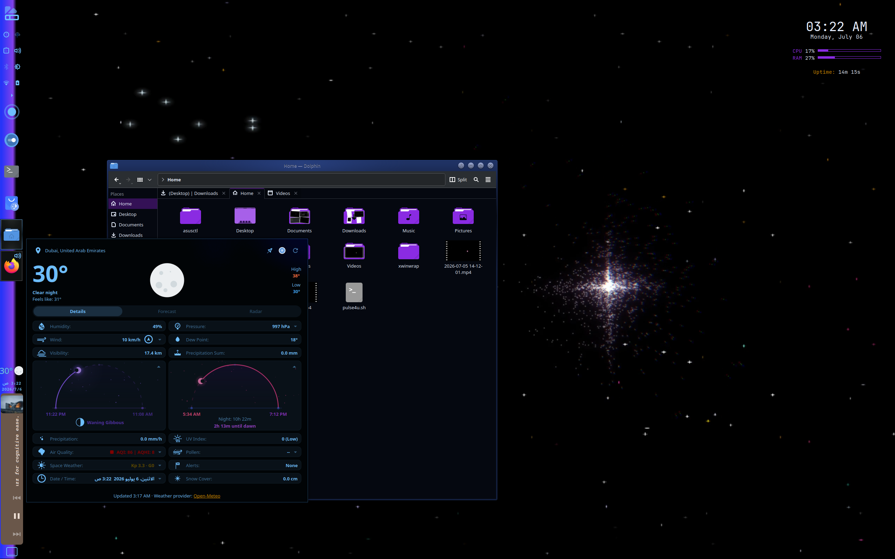

# PULSE-4U

A Linux desktop rice built for the GDGoC Linux Desktop Ricing Exhibition.

A dying star in the void, pulsing with sound, fading, and reaching out toward the cursor and sound. Pulse refers to the flare on the wallpaper, which breathes in and out with audio input. 4U means "for you." The whole desktop is built to react to the person using it, reacting to their presence.

Inspired by the ARTE Museum in Dubai and the Pleiades myth.



## Environment

| Component | Details |
|---|---|
| OS | Kubuntu 26.04 LTS |
| DE | KDE Plasma 6.6.5 |
| WM | KWin (X11) |
| Terminal | Konsole |
| Shell | Bash |

## Palette

| Role | Color |
|---|---|
| Primary (Electric Amethyst) | `#8A2BE2` |
| Secondary (Amber Gold) | `#D48A00` |
| Background (Void Navy) | `#050810` |
| Text (Cool White) | `#E8F0FF` |
| Accent (Neon Pink) | `#FF3399` |

## What's in here

- **Wallpaper** : a video loop exported from a TouchDesigner project (`touchdesigner/pulse4u.toe`), audio-reactive and cursor-responsive when running live. The desktop plays back a recorded loop of it.
- **Terminal** : custom Fastfetch ASCII logo, themed Konsole color scheme with transparency, colored Bash prompt.
- **Conky** : a top-right HUD showing clock, date, CPU, RAM, and uptime.
- **Panel** : minimal, transparent, with a Weather and Media Player widget.
- **KDE color scheme** : the palette above applied system-wide through KDE's native color settings.

## Structure

```
pulse-4u-rice/
├── README.md
├── dotfiles/
│   ├── .bashrc
│   └── .config/
│       ├── fastfetch/
│       ├── konsole/
│       ├── conky/
│       └── autostart/
├── touchdesigner/
│   └── pulse4u.toe
└── screenshots/
```

## Notes

TouchDesigner does not run natively on Linux. This project runs it through Proton, and the wallpaper is played back as a recorded video loop rather than live, since a live wallpaper setup wasn't reliable enough for daily use.

If using TD file:
To experience flare's response, turn on node "audioDev2" Active field to **ON**!


Play a song and watch it respond.
Suggestion: We will meet again by Fresca (The flare loves this song)

For mic, activate "audioDev1" node the same way (it's below audioDev2)

The Pleiades stars activate when you move the cursor around a certain position, goodluck finding it!


Built by Amal.
